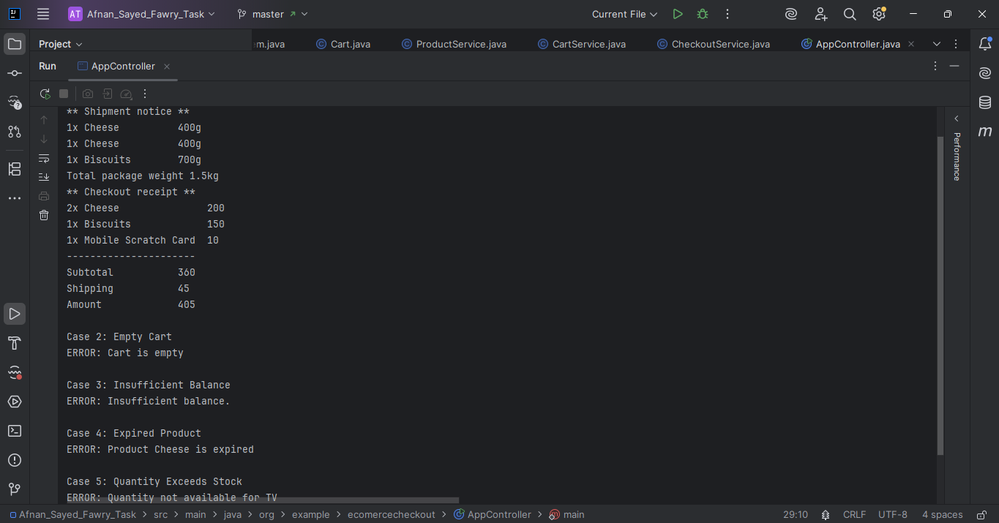

# 🛒 E-commerce Checkout System
## Description

This Java-based console application simulates a simple e-commerce checkout system with the following features:

- Define different types of products with name, price, quantity.
- Support for **expirable products** (e.g., Cheese, Biscuits) with expiry date.
- Support for **shippable** and **non-shippable** products.
- Add products to cart in specific quantities (must not exceed available stock).
- Perform checkout:
  - Print **shipment notice** with weight and item details.
  - Print **checkout receipt** with subtotal, shipping, total, and customer balance.
  - Validate corner cases: empty cart, insufficient balance, expired product, quantity over stock.
---


## Test Cases & Output Summary
- Case 1: Successful Checkout
Description: Customer has enough balance, valid products, and sufficient stock.
Output: Checkout completes with receipt and shipping label.

- Case 2: Empty Cart
Description: Customer tries to checkout with an empty cart.
Output: ERROR: Cart is empty

- Case 3: Insufficient Balance
Description: Customer balance is less than total cart amount.
Output: ERROR: Insufficient balance.

- Case 4: Expired Product
Description: Cart contains an expired product.
Output: ERROR: Product [name] is expired

- Case 5: Quantity Exceeds Stock
Description: Requested quantity is greater than available stock.
Output: ERROR: Quantity not available for [product name]
---

## Test Cases Covered (with Code & Output)
### Case 1: Successful Checkout
```
Customer customer1 = new Customer("Afnan", 1000);
cart.add(cheese, 2);        // Cheese: 100 EGP, 0.4kg, exp in 2 days
cart.add(biscuits, 1);      // Biscuits: 150 EGP, 0.7kg, exp in 5 days
cart.add(scratchCard, 1);   // Mobile Scratch Card: 10 EGP, not shippable
checkout(customer1, cart);
```
Console Output:
```
** Shipment notice **
1x Cheese          400g
1x Cheese          400g
1x Biscuits        700g
Total package weight 1.5kg

** Checkout receipt **
2x Cheese               200
1x Biscuits             150
1x Mobile Scratch Card  10
----------------------
Subtotal                360
Shipping                45
Amount                  405
```
### Case 2: Empty Cart
```
Customer customer2 = new Customer("Sayed", 500);
CartService emptyCart = new CartService();
checkout(customer2, emptyCart);
```
Console Output:
```
ERROR: Cart is empty
```
### Case 3: Insufficient Balance
```
Customer customer3 = new Customer("Mahmoud", 50);
cart.add(tv, 1);           // TV: 500 EGP, 8.0kg
checkout(customer3, cart);
```
Console Output:
```
ERROR: Insufficient balance.
```
### Case 4: Expired Product
```
Customer customer4 = new Customer("Alaa", 1000);
cart.add(expiredCheese, 1); // Cheese: expired yesterday
checkout(customer4, cart);
```
Console Output:
```
ERROR: Product Cheese is expired
```
### Case 5: Quantity Exceeds Stock
```
Customer customer5 = new Customer("Hamza", 1000);
cart.add(tv, 5);           // TV: only 2 in stock
```
Console Output:
```
ERROR: Quantity not available for TV
```
---
## Output after running
- You will find ```app-console-output.png``` file which includes the result in the console after running AppController
  

---

## Assumptions 
I noticed in the output console example that the shipping cost was 30 when the weight was nearly 1 kg (1.1kg → 30 EGP shipping), so I assumed the shipping cost is 30 EGP per kg.

---
## Run the Project
1. Clone the repository:
```
git clone https://github.com/YourUsername/Checkout-System.git
cd Checkout-System
```
2. Run AppController.java

## Technologies Used
Java
